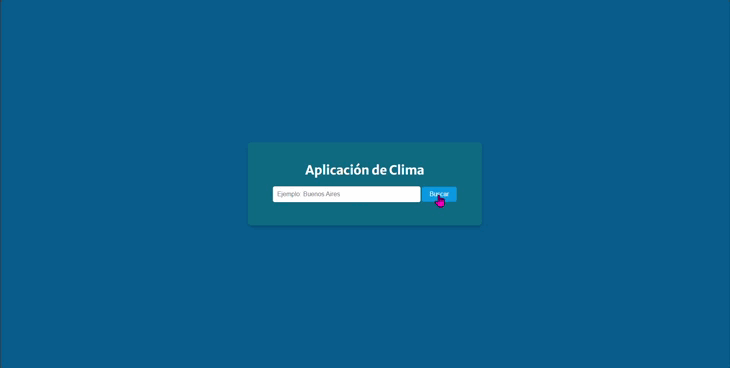

# Aplicación de Clima

Esta es una aplicación web sencilla que permite a los usuarios buscar información del clima de cualquier ciudad utilizando la API de OpenWeather. La aplicación muestra la temperatura, la humedad, la descripción del clima y un ícono representativo del estado meteorológico.

> **Nota:** Esta aplicación fue desarrollada como parte del curso de **DigitalHouse**, en el módulo de **JavaScript para el DOM**.

## Características

- Busca el clima de cualquier ciudad del mundo.
- Muestra la temperatura en grados Celsius, la humedad y una breve descripción del clima.
- Proporciona un ícono representativo del estado meteorológico.
- Soporte en español.
- Diseño responsivo para adaptarse a diferentes tamaños de pantalla.

## Tecnologías Utilizadas

- **HTML5**: Estructura de la aplicación.
- **CSS3**: Estilos para la interfaz de usuario, incluyendo diseño responsivo.
- **JavaScript (Vanilla JS)**: Lógica para la interacción con la API y actualización de la interfaz.
- **OpenWeather API**: Fuente de los datos meteorológicos.

## Instalación

1. Clona este repositorio en tu máquina local:
   ```bash
   git clone https://github.com/rosannyoropeza/aplicacion-clima.git

2. Navega a la carpeta del proyecto:
   ```
   cd aplicacion-clima

3. Abre el archivo index.html en tu navegador web.

## Configuración
Para que la aplicación funcione correctamente, es necesario tener una clave de API de OpenWeather. Una vez que obtengas tu clave, asegúrate de configurarla en el archivo script.js:
    ```
    const API_KEY = 'TU_CLAVE_DE_API_AQUI';

Reemplaza 'TU_CLAVE_DE_API_AQUI' con tu propia clave de API.

## Uso
Abre la aplicación en un navegador web.
Escribe el nombre de la ciudad de la cual deseas obtener el clima en el campo de búsqueda.
Haz clic en el botón "Buscar" para obtener los datos del clima.
La información del clima se mostrará en la página, incluyendo la temperatura, la humedad y una breve descripción.

## Diseño Responsivo
La aplicación está diseñada para adaptarse a diferentes tamaños de pantalla. Se han utilizado consultas de medios (@media queries) para garantizar que el diseño sea amigable en dispositivos móviles, tabletas y computadoras de escritorio.

## Mejoras Futuras
Algunas posibles mejoras para futuras versiones incluyen:

- Agregar la posibilidad de buscar por coordenadas geográficas.
- Mostrar información adicional, como la velocidad del viento y la presión atmosférica.
- Guardar las ciudades buscadas recientemente.
- Cambiar el esquema de colores según el estado del clima (por ejemplo, usar colores más fríos para climas fríos).

## Capturas de Pantalla

<p> </p>
<p> </p>
<p> </p>

## Créditos

Esta aplicación fue desarrollada utilizando datos proporcionados por la API de OpenWeather y con los conocimientos y diseño proporcionados por parte del curso de **DigitalHouse**, en el módulo de **JavaScript para el DOM**.
